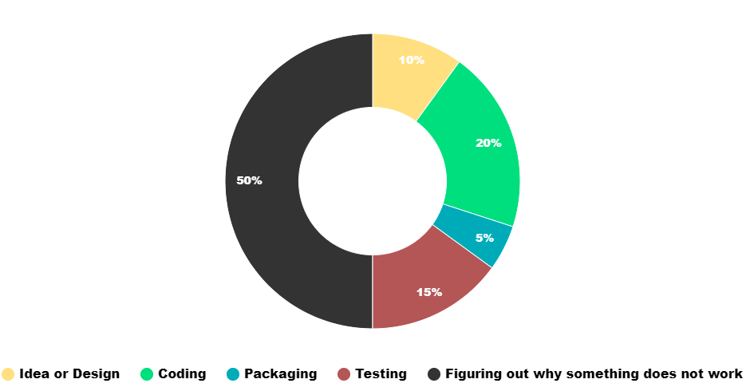

# Introduction to Python programming and Application development

These are some simple scripts and applications created as part of learning and mentoring the Python programming language.

Software design in a nutshell:

## Links

* [Python Download](https://www.python.org/downloads/)
* [Python documentation](https://docs.python.org/3.10/tutorial/index.html)

### Python Concepts

* [f strings](https://realpython.com/python-f-strings/)
* [Requests module](https://docs.python-requests.org/en/latest/)
* [JSON module](https://docs.python.org/3/library/json.html)
* [Jinga2 templates](https://realpython.com/primer-on-jinja-templating)
* [strftime](https://www.programiz.com/python-programming/datetime/strftime)

### IDE and Developer Tools

* [Visual Studio Code](https://code.visualstudio.com/)
* [Spyder](https://www.spyder-ide.org/)
* [Insomnia REST client](https://insomnia.rest/download)
* [Editor Config](https://editorconfig.org/) - A tool to ensure source code formatting, popular text editors have plugins to recognize this convention.

### Source code management using Git

* [Introduction to Git](https://www.w3schools.com/git/)
* [A step-by-step guide to Git](https://opensource.com/article/18/1/step-step-guide-git) - good introduction to working with Git version control tools. 
* [GitHub](https://github.com/) - the popular free Git repository host.
* [Git downloads](https://git-scm.com/downloads) - command line git client
* [Git GUI clients](https://git-scm.com/downloads/guis) - I recommend trying the [Github Desktop](https://desktop.github.com/)

### Languages and concepts

* [JSON](https://www.json.org/json-en.html)
* [HTTP Response Codes](https://developer.mozilla.org/en-US/docs/Web/HTTP/Status#successful_responses)
* [HTML](https://www.w3schools.com/html/)
* [CSS](https://www.w3schools.com/css/)
* [Javascript](https://www.w3schools.com/js/)
